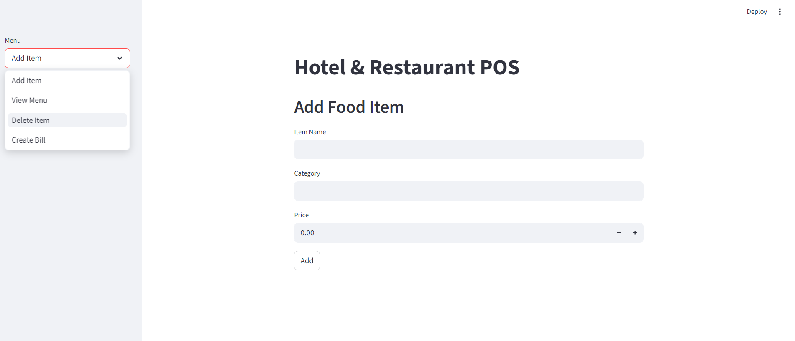
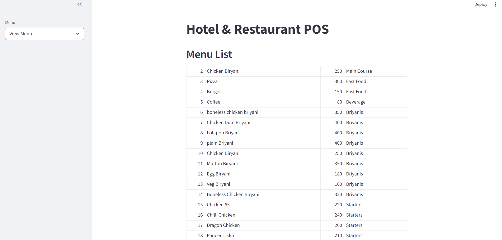
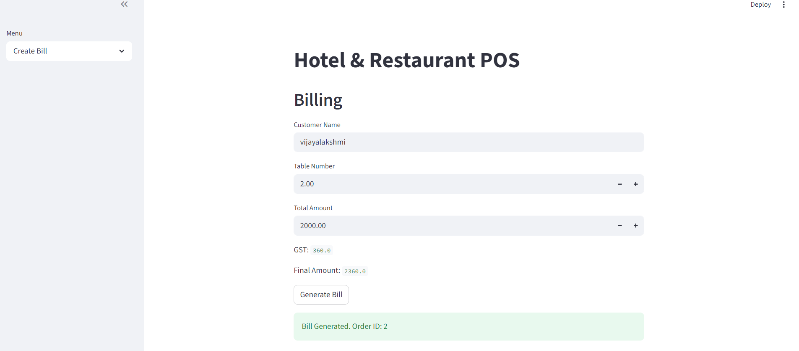

# hotel-restaurant-pos-system
# Hotel & Restaurant POS Management System

A full-stack Hotel & Restaurant Point of Sale (POS) Management System developed using Python, PostgreSQL, and Streamlit. This application helps restaurants and hotels manage menu items, customer billing, and order records efficiently through an interactive dashboard.

---

## Features

* Add Menu Items
* View Menu Items
* Delete Menu Items
* Billing System
* GST Calculation
* PostgreSQL Database Integration
* Streamlit Dashboard
* Order Management
* CRUD Operations

---

## Technologies Used

| Technology   | Purpose               |
| ------------ | --------------------- |
| Python       | Backend Development   |
| PostgreSQL   | Database Management   |
| Streamlit    | Frontend Dashboard    |
| psycopg2     | Database Connectivity |
| Git & GitHub | Version Control       |

---

## Project Structure

```text
hotel_pos_system/
│
├── app.py
├── db.py
├── requirements.txt
├── README.md
│
├── database/
│   └── schema.sql
│
├── modules/
│   ├── auth.py
│   ├── billing.py
│   ├── menu.py
│   ├── orders.py
│   ├── reports.py
│   └── tables.py
│
├── pdf/
│   └── invoice.py
│
└── screenshots/
```

---

## Database Tables

* menu
* users
* orders
* order_items

---

## Installation & Setup

### 1. Clone Repository

```bash
git clone https://github.com/VijayalakshmiDuvuru16/hotel-restaurant-pos-system.git
```

### 2. Open Project Folder

```bash
cd hotel-restaurant-pos-system
```

### 3. Install Required Packages

```bash
pip install -r requirements.txt
```

### 4. Configure PostgreSQL Database

Create a PostgreSQL database named:

```sql
hotel_pos
```

Run the SQL file inside:

```text
database/schema.sql
```

### 5. Update Database Credentials

Open `db.py` and update:

```python
host="localhost"
database="hotel_pos"
user="postgres"
password="your_password"
port="5432"
```

### 6. Run Application

```bash
python -m streamlit run app.py
```

---

## Screenshots

### Dashboard

Add image inside `screenshots/` folder and use:

```md

```

### Billing Page

```md

```

### Menu Management

```md

```

---

## Future Enhancements

* Update Menu Items
* Login Authentication
* PDF Invoice Download
* Inventory Management
* Online Payment Integration
* Sales Analytics Dashboard
* QR Code Billing

---

## Learning Outcomes

This project helped in understanding:

* Python Application Development
* PostgreSQL Database Integration
* CRUD Operations
* Streamlit Dashboard Development
* SQL Query Execution
* GitHub Version Control

---
## Screenshots

### Dashboard


### Menu Page


### Billing Page


---

## Author

**Vijayalakshmi Duvuru**

GitHub:

[https://github.com/VijayalakshmiDuvuru16](https://github.com/VijayalakshmiDuvuru16)
